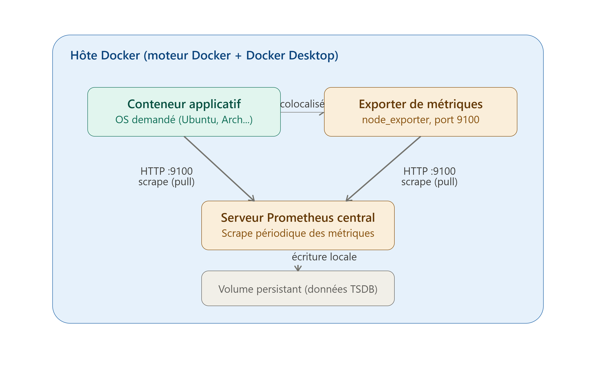

## Contexte :

Nous allons créer notre propre offre cloud où les utilisateurs pourront demander une nouvelle machine qui sera automatiquement accessible. La création de cette machine sera accompagnée systématiquement d’une solution de supervision standardisée ainsi qu’une garantie de disponibilité de services. En tant que développeur, nous omplémenterons la demande de création et la demande de suppression se passera à travers un script bash exécutable depuis un conteneur éphémère. Notre solution cloud doit reposer sur Terraform. Pour le moment, nous n’avons qu’une machine avec le moteur Docker accessible via l’outil en ligne de commande docker ainsi que Docker Desktop pour ceux qui sont plus à l’aise avec une interface graphique.

Comme les outils ne sont pas limités, il faut prendre bien à soin à inclure dans chaque commit uniquement les modifications utiles pour répondre précisément à la demande. En cas de réponse trop large, les points ne pourront pas être attribué

## Questionnaire : 

 1. Réaliser un schéma complet au format png qui présente le principe de fonctionnement de l’architecture. ? Le formalisme est laissé libre mais les éléments suivants doivent être précisés : un trait entre 2 composants doit indiquer un flux, il faut préciser le protocole utilisé par le flux ainsi que la direction du flux.

2. A l’étape 0, si vous deviez utiliser terraform depuis un conteneur Docker pour manipuler des ressources Docker, quelles seraient les contraintes à prendre pour pouvoir utiliser terraform depuis un conteneur Docker ?

3. Dans l’étape 1, pourquoi pourriez-vous avoir besoin d’un backend ? A quoi cela sert-il ?

4. Pourquoi cette instruction « Rendre accessible uniquement 2 images via terraform afin que les utilisateurs demandent la création d’un OS Ubuntu ou bien d’un OS Arch en version latest. » peut poser problème sur el moyen/long terme ?

5. Je souhaite créer un conteneur avec la commande « docker run --network host -p 9090 ubuntu :latest ». Quelle erreur non bloquante est commise ?

6. Dans l’instruction « docker run -network host -p 9090 ubuntu:latest” à quoi sert l’option network ?

7. Pour quelle raison pourrions-nous vous demandez de provisionnez un sous-réseau différent pour chaque nouvelle instance ?

7. Nous étudions la solution de supervision prometheus. Comment pourrions-nous faire évoluer l’environnement complet pour ajouter la supervision via prometheus ? Combien de nouvelles ressources et de quelles ressources aurions-nous besoin ? Proposer un nouveau schéma en indiquant l’intégration du serveur Prometheus.

## Réponse : 

1.
    

2. Pour que Terraform manipule des ressources Docker depuis l'intérieur d'un conteneur il faut : 

- Monter le socket Docker de l'hôte à l'intérieur du conteneur épphémère, pour que le provider puisse dialoguer avec le démon Docker de l'hôte. Sans cela, Terraform ne voit aucun moteur Docker.
- Gérer les droits/permissions, le socket appartient généralement au groupe docker ou root. L'utilisateur exécutant Terraform dans le conteneur doit avoir les droits suffisants pour lire/écrire sur ce socket, sinon ``Permision Denied``.
- En terme ne sécurité, monté le socket Docker équivaut à donner un accès root sur l'hôte. C'est une vrai ouverture de sécurité à documenter et à restreindre (réseau isolé, conteneur jetable, pas d'accès internet inutile).
- Cohérence des volumes. Si Terraform crée des columes ou monte des chemins, les chemins référencés sont résolus côté hôte, pas dans le filesystem du conteneur éphémère. Il faut donc bien distinguer le filesystem du conteneur Terraform et celui de l'hôte 
- Image Terraform avec le binaire adapté : l'image du conteneur éphémère doit contenir le binaire Terraform.
- Etat accessible : comme le conteneur et éphémère, il faut que le fichier d'état Terraform ne soit pas perdu à la destruction du conteneur

3. Un backend sert à stocker le fichier d'état de manière persistante et partagée, en dehors du conteneur éphémère qui, par définition est détruit après chaque exécution.

Sans backend distant, l'état serait stocké localement dans le conteneur, donc perdu à chaque exécution, Terraform ne saurait plus quelles ressources existent déjà, et recréerait ou perderait la trace des machines.
Il serait impossible de gérer plusieurs demandes concurrentes sans verrouillage centralisé.
Il n'y aurait pas de cohérence entre la demznde de création et la demande de suppréssion car pour détruire une ressource, Terraform a besoin de connaître son état précédent.

Un backend permet donc de persister l'état entre chaque invocation de conteneur éphémère, de gérer le verrouillage pour éviter les conflits, et de garantir que ``destroy`` retrouve bien les ressources crées par ``apply``

4. Le fait de "Rendre accessible uniquement 2 images via terraform afin que les utilisateur demande la création d'un OS Ubuntu ou bien d'un OS Arch en version latest" peut ammener à plusieurs problèmes.

Tout d'abord ``Latest`` est un tag qui change avec le temps. Deux déploiement à des dates différentes peuvent donner des versions d'OS différentes, cassant la cohérence et la reproductibilité. Une mise à jour de l'image latest peut introduire des régressions non maîtrisées.

Ensuite, limiter à 2 OS ne permet pas de répondre à l'évolution des besoins (Debian, Windows, LTS spécifique...). Toute évolution de l'offre nécessiterait de modifier le code Terraform "en dur", ce qui est meu maintenable et peu scalable. (pas de paramétrage générique de catalogue d'images).

On ne pourra pas garantir à un client qu'il aura la même version d'OS demain qu'aujourd'hui, ce qui pose un problème de support et de stabilité.

Enfin, il est impossible de figer une version testée et validée (patch de sécurité connu); latest peut introduire une faille ou une incompatibilité du jour au lendemain sans contrôle.
La bonne pratique serait de référencer des tags versionnés explicitement (ex: ubuntu:22.04, archlinux:base-20240601) gérés via une variable/catalogue, avec un processus de mise à jour contrôlé.

5. L'option -p 9090 est incompatible et inutile avec ``--network host`` en mode host, le conteneur partage directement la pile réseau de l'hôte, donc il ln'y a pas de mapping de port à faire, tous les ports du conteneur son déjà directement ceux de l'hôte. Docker ne bloque pas la commande, mais émet un avertissement et ignore l'option -p.

6. L'option network définit le mode réseau du conteneur, c'est à dire comment il accède au réseau : 
- Brige : le conteneur a sa propre interface réseau isolée, reliée à l'hôte via un port virtuel et NAT.
- Host : le conteneur paratage directement la pile réseau de l'hôte.
- None : aucun accès réseau.
- nom_de_réseau : rattache le conteneur à un réseau docker spécifique permettant la communication entre conteneurs par nom DNS.

7. Vous pourriez demandez de provisionner un sous-réseau différent pour chaque nouvelle instance pour plusieurs raison possible : 

- Isolation réseau entre clients/instances : éviter que les conteneurs de différents utilisateurs puissent se voir ou communiquer entre eux (sécurité, cloisonnement multi-tenant).

- Éviter les conflits d'adresses IP/de noms : si chaque client a ses propres ressources (base de données, services internes) avec des plages d'adresses ou des noms DNS internes, un sous-réseau dédié évite les collisions.

- Contrôle d'accès granulaire : appliquer des règles de pare-feu ou de routage spécifiques par sous-réseau (par client, par environnement).

- Scalabilité et organisation : faciliter l'ajout/suppression dynamique de ressources réseau par instance, sans impacter les autres, et faciliter le nettoyage complet (suppression du sous-réseau = suppression de toute la configuration réseau de l'instance).

8. 
Pour chaque nouvelle instance applicative créée :

Un conteneur exporter de métriques (ex: node_exporter) à côté du conteneur applicatif, exposant les métriques système sur un port (ex: 9100).

Au niveau global de l'infrastructure (une seule fois, pas par instance) :

2. Un conteneur serveur Prometheus central, avec sa configuration (prometheus.yml) listant les cibles (targets) à scraper.

3. Un mécanisme de découverte/mise à jour de la configuration Prometheus : à chaque création/suppression d'instance, il faut ajouter/retirer la cible correspondante dans la configuration Prometheus (soit via génération dynamique du fichier de config + reload, soit via un mécanisme de service discovery basé sur les labels Docker).

4. (Optionnel mais recommandé) Un volume persistant pour les données Prometheus, afin de ne pas perdre l'historique des métriques si le conteneur est recréé.

5. (Optionnel) Un service Alertmanager / Grafana si l'on veut aller au-delà de la simple collecte (alerting, visualisation) — mais ce n'est pas strictement requis pour répondre à "ajouter la supervision via Prometheus".
Donc, au minimum : 2 ressources par instance (conteneur applicatif + exporter), et 1 ressource globale (serveur Prometheus, créé une seule fois et partagé par toutes les instances), plus la logique Terraform de mise à jour de sa configuration.

